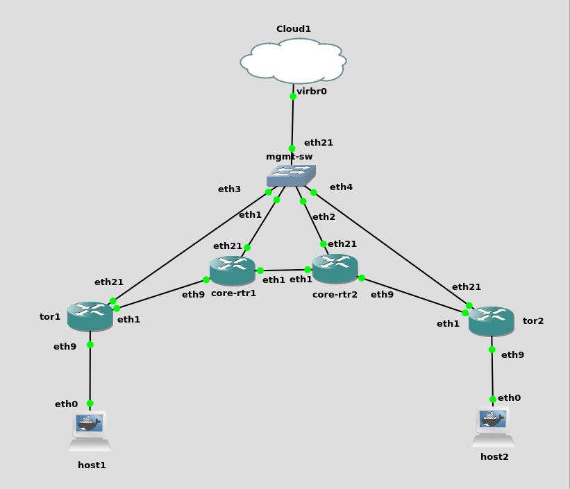

# nanog81-hackathon

## Setup

### PyangBind
I committed the generated openconfig python bindings into the ocbind directory already, however, if you would like to produce bindings for the latest yang models, you can run the following:

```bash
# Assuming you want to use a virtualenv
python3 -mvenv mvenv
source venv/bin/activate
pip install pyang pyangbind

# Download the openconfig yang models
git clone https://github.com/openconfig/public.git ../openconfig-yang/
git clone https://github.com/YangModels/yang ../yang/

# Generate bindings for interfaces and BGP
pyang --plugindir venv/lib/python3.8/site-packages/pyangbind/plugin \
--split-class-dir ocbind -p ../yang/standard/ietf/RFC \
-p ../openconfig-yang/release/models/  \
../openconfig-yang/release/models/interfaces/openconfig-interfaces.yang \
../openconfig-yang/release/models/interfaces/openconfig-if-ip.yang \
../openconfig-yang/release/models/bgp/openconfig-bgp.yang-f pybind
```

### gNMIc
In the interest of time, my gNMI calls shell out to `gnmic` instead of building a python client from protobuf definitions. To use the client as is, you'll need to install gnmic:

`curl -sL https://github.com/karimra/gnmic/raw/master/install.sh | sudo bash`

Althernatively, build a proper gNMI client and replace hackathon.utils.gnmi with calls to the generated client.

### API Requirements

```bash
# Virtualenv from above or create if not exists yet
python3 -mvenv mvenv
source venv/bin/activate
pip install -r requirements.txt
```
## Run the API
Currently the API produces a sqlite DB at `/tmp/hackathon.db` and on every restart re-initializes all the lab data in the DB. The calls to delete the /tmp/hackathon.db and initalize_lab can be removed to not re-init on every startup.

Run the API with `python run.py` and view the Swagger UI at http://localhost:8000

## My Lab Environment



The lab environment I used for this hack has 2 "core" routers in AS 64512 with point-to-point links configured as pictured. All routers have connected routes redistributed into BGP.

Each "tor" router is in it's own AS 64513, 64514 respectively. And each have a VLAN configured with a host attached in that VLAN.

The mgmt-sw is just there to link my desktop to each of the devices so that I can issue SSH and gNMI requests directly from my desktop.

All devices are running cEOS.

Minimal initial management config:
```bash
username admin privilege 15 role network-admin secret admin
!
interface Ethernet21
   no switchport
   ip address 192.168.123.5/24
!
ip routing
!
ip route 0.0.0.0/0 192.168.123.1
!
management api gnmi
   transport grpc default
```

## API 
The API currently supports 3 operations:
* Priovision TOR
* Add VLAN
* Edit Access Port

All 3 operations are achieved using OpenConfig. It should be noted that adding a VLAN doesn't fully work. Due to either a bug in my openconfig model or a bug with cEOS, you must log into the device after initially configured and run `no shutdown` on the created VLAN interface. I've opened a TAC case for this.

### Provision TOR
This API creates a point-to-point link between the new TOR and the designated core-rtr. It also establishes the BGP neighborship between the two, in addition to all of the basic BGP set up on the TOR (creating the BGP routing instance with the appropriate ASN and redistributing connected routes). The only thing that needs to be configured prior to running this API on the TOR is a functioning management network so that it's reachable from the API host.

### Add VLAN
This API is supposed to create a new SVI on the TOR. As mentioned before, this currently requires a manual `no shutdown` call on the device to properly bring up the SVI.

### Edit Access Port
This API modifies the access vlan on the given port and sets a new interface description if provided.

## OpenConfig gNMIc Examples

### Configure BGP ASN

```bash
gnmic --log -a 192.168.123.2:6030 -u admin -p admin --insecure set --update-path /network-instances/network-instance[name=default]/protocols/protocol[name=BGP]/bgp/global/config --update-file bgp_as.json

cat bgp_as.json
{
    "openconfig-bgp:as": 64512
}
```

### Redistribute Connected Routes

```bash
gnmic --log -a 192.168.123.2:6030 -u admin -p admin --insecure set --update-path network-instances/network-instance[name=default]/table-connections/ --update-file redist.json

cat redist.json
{
    "openconfig-network-instance:table-connection": [
        {
            "src-protocol": "openconfig-policy-types:DIRECTLY_CONNECTED",
            "dst-protocol": "openconfig-policy-types:BGP",
            "address-family": "openconfig-types:IPV4",
            "config": {
                "src-protocol": "openconfig-policy-types:DIRECTLY_CONNECTED",
                "address-family": "openconfig-types:IPV4",
                "dst-protocol": "openconfig-policy-types:BGP"
            }
        },
        {
            "src-protocol": "openconfig-policy-types:DIRECTLY_CONNECTED",
            "dst-protocol": "openconfig-policy-types:BGP",
            "address-family": "openconfig-types:IPV6",
            "config": {
                "src-protocol": "openconfig-policy-types:DIRECTLY_CONNECTED",
                "address-family": "openconfig-types:IPV6",
                "dst-protocol": "openconfig-policy-types:BGP"
            }
        }
    ]
}
```

### Configure Point-To-Point Interface
```bash
gnmic --log -a 192.168.123.2:6030 -u admin -p admin --insecure set --update-path /interfaces/interface[name=Ethernet1] --update-file eth1.json

cat eth1.json
{
    "openconfig-interfaces:name": "Ethernet1",
    "openconfig-interfaces:config": {
        "name": "Ethernet1",
        "description": "core-rtr2 Ethernet1",
        "enabled": true
    },
    "openconfig-interfaces:subinterfaces": {
        "subinterface": [
            {
                "index": "0",
                "config": {
                    "enabled": true
                },
                "openconfig-if-ip:ipv4": {
                    "addresses": {
                        "address": [
                            {
                                "ip": "10.0.0.0",
                                "config": {
                                    "ip": "10.0.0.0",
                                    "prefix-length": 31,
                                    "arista-intf-augments:addr-type": "PRIMARY"
                                }
                            }
                        ]
                    },
                    "config": {
                        "enabled": true
                    }
                }
            }
        ]
    }
}
```

### Configure SVI

```bash
gnmic --log -a 192.168.123.4:6030 -u admin -p admin --insecure set --update-path /interfaces/interface[name=Vlan101] --update-file v101.json

cat v101.json
{
    "openconfig-interfaces:name": "Vlan101",
    "openconfig-interfaces:config": {
        "name": "Vlan101",
        "type": "iana-if-type:l3ipvlan",
        "description": "prod-1",
        "enabled": true
    },
    "openconfig-vlan:routed-vlan": {
        "config": {
            "vlan": "Vlan101"
        },
        "openconfig-if-ip:ipv4": {
            "addresses": {
                "address": [
                    {
                        "ip": "11.0.1.1",
                        "config": {
                            "ip": "11.0.1.1",
                            "prefix-length": 24,
                            "arista-intf-augments:addr-type": "PRIMARY"
                        }
                    }
                ]
            },
            "config": {
                "enabled": true
            }
        }
    }
}
```

### Configure Access Port
```bash
gnmic --log -a 192.168.123.4:6030 -u admin -p admin --insecure set --update-path /interfaces/interface[name=Ethernet9] --update-file eth9.json

cat eth9.json
{
    "openconfig-interfaces:name": "Ethernet9",
    "openconfig-interfaces:config": {
        "name": "Ethernet9",
        "description": "host1",
        "enabled": true
    },
    "openconfig-if-ethernet:ethernet": {
        "openconfig-vlan:switched-vlan": {
            "config": {
                "access-vlan": 101
            }
        }
    }
}
```

### Configure BGP Neighbor
```bash
gnmic --log -a 192.168.123.2:6030 -u admin -p admin --insecure set --update-path /network-instances/network-instance[name=default]/protocols/protocol[name=BGP]/bgp/neighbors/neighbor[neighbor-address=10.0.0.1] --update-file bgp_nei.json

cat bgp_nei.json
{
    "openconfig-bgp:neighbor-address": "10.0.0.1",
    "openconfig-bgp:config": {
        "neighbor-address": "10.0.0.1",
        "enabled": true,
        "peer-as": 64512,
        "description": "core-rtr2"
    }
}
```